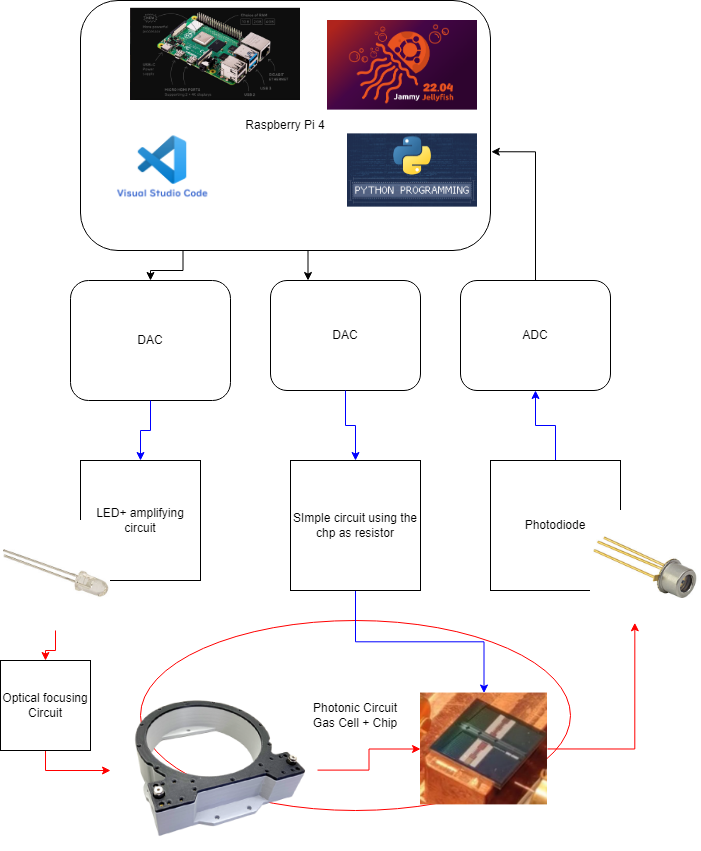

# Capstone_G2_2022-2023: Developing a Near Infrared On Chip CO2 Sensor

This software project goal is to use the strong waveguide properties of a silicon ring resonator built on a microchip to create very acurate absorption spectra to be analysed by a raspberry pi

## Step 1 raspberry Pi + Desktop simulation
  
Control System centered around Rpi-4  
 
## Step 2: Prototype 1

### Current Design Diagram

### Test0 Results

Voltage Outputs 
 

Latency 
 

### Test1 Results

No ramp 

 

 

Ramp Temperature applied 
 